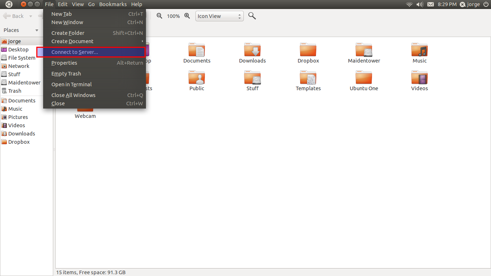
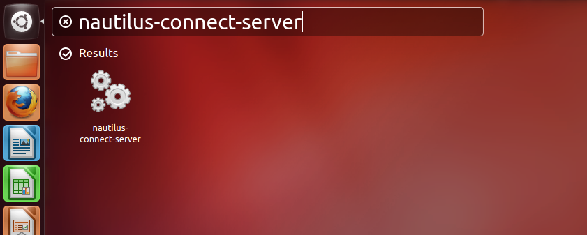
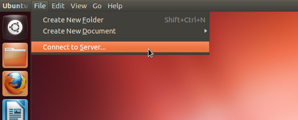

Linux FAQ
=========
   
.. toctree::
   :maxdepth: 2

.. TEMPLATE: `link <link>`_

Click on the links in the headings for more information.

`tar/untar or zip/unzip <http://www.simplehelp.net/2008/12/15/how-to-create-and-extract-zip-tar-targz-and-tarbz2-files-in-linux/>`_
-----------------------------------------------------------------------------------------------------------------------------------
  Compress:

  .. code-block:: bash

    tar -zcvf archive_name.tar.gz directory_to_compress
    tar -jcvf archive_name.tar.bz2 directory_to_compress
    zip -r archive_name.zip directory_to_compress

  Uncompress:

  .. code-block:: bash

    tar -zxvf archive_name.tar.gz
    tar -jxvf archive_name.tar.bz2 -C /tmp/extract_here/
    unzip archive_name.zip

`Search for files in directory <http://www.codecoffee.com/tipsforlinux/articles/21.html>`_
------------------------------------------------------------------------------------------

  .. code-block:: bash

    find / -name 'program.c'

`Find size of directory <http://unix.stackexchange.com/questions/185764/how-do-i-get-the-size-of-a-directory-on-the-command-line>`_
-----------------------------------------------------------------------------------

  .. code-block:: bash

    du -sh folder

`Print all environmental variables <http://askubuntu.com/questions/275965/how-to-list-all-variables-names-and-their-current-values>`_
-------------------------------------------------------------------------------------------------------------------------------------

  .. code-block:: bash

    printenv

  To show a list including the "shell variables":

  .. code-block:: bash

    ( set -o posix ; set ) | less

`Download file from the internet <http://www.thegeekstuff.com/2009/09/the-ultimate-wget-download-guide-with-15-awesome-examples/>`_
-----------------------------------------------------------------------------------------------------------------------------------

  .. code-block:: bash

    wget http://www.openss7.org/repos/tarballs/strx25-0.9.2.1.tar.bz2

GUI utility to mount remote filesystems over SSH
-----------------------------------------------------------------------------------------------------------------------------------------------------

`Older versions of Ubuntu (<11.10) <http://askubuntu.com/questions/4625/is-there-a-gui-utility-to-mount-remote-filesystems-over-ssh>`_
^^^^^^^^^^^^^^^^^^^^^^^^^^^^^^^^^^^^^^^^^^^^^^^^^^^^^^^^^^^^^^^^^^^^^^^^^^^^^^^^^^^^^^^^^^^^^^^^^^^^^^^^^^^^^^^^^^^^^^^^^^^^^^^^^^^^^^
By default the GVFS in GNOME supports SSH connections. Click on the nautilus icon (the folder with the house on it) it will launch the file manager.

Then go to File -> "Connect to server":

.. image:: images/ssh-remote_mount-dialog.png

Paste in the following:

=========  ==============================
Sever:     bioeng10.bioeng.auckland.ac.nz
Folder:    /hpc/upi
UserName:  upi
=========  ==============================

Click connect and put in your password (ask it to forget immediately for now)

This will mount the remote SSH server in a folder you can access from the file manager. If you need to access the mount in the command line it's in .gvfs.

You can also mount it in Nautilus. Just hit CTRL+L and in the address bar type: ssh://server-ip/somepath/

`Newer versions of Ubuntu (>11.10) <http://askubuntu.com/questions/34768/where-is-connect-to-server-for-ssh-connections-in-unity>`_
^^^^^^^^^^^^^^^^^^^^^^^^^^^^^^^^^^^^^^^^^^^^^^^^^^^^^^^^^^^^^^^^^^^^^^^^^^^^^^^^^^^^^^^^^^^^^^^^^^^^^^^^^^^^^^^^^^^^^^^^^^^^^^^^^^^
press Alt+F2 and type nautilus-connect-server as shown below.

